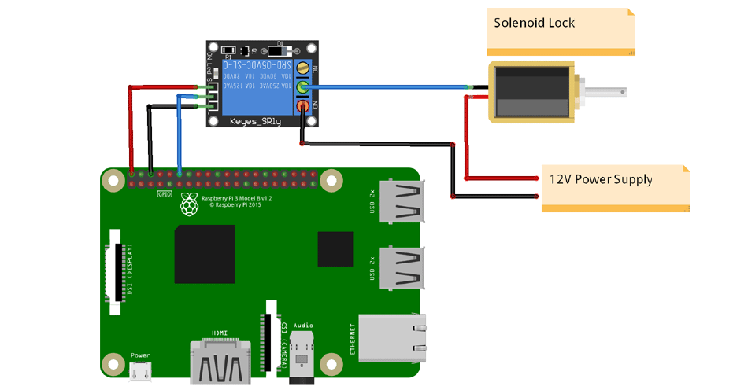
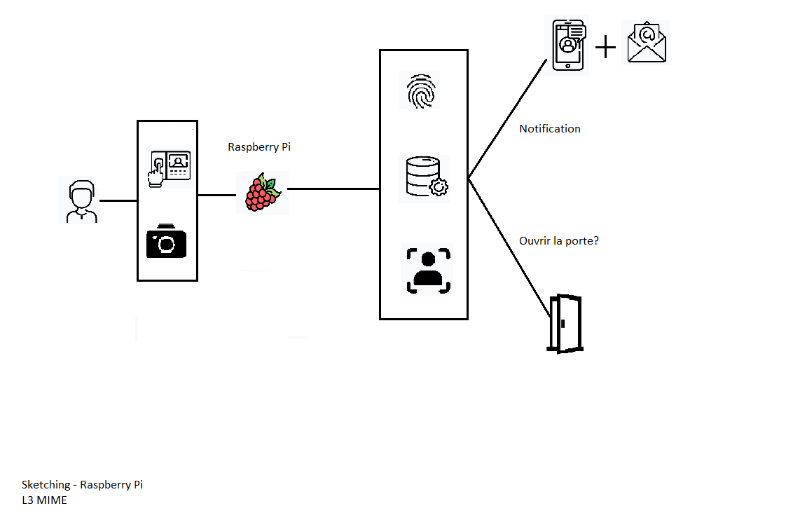

# Two-Way Door Lock Security System - Raspberry Pi - OpenCV
# Thi PHAN - Student of Computer Science - University Paris 8 - Course Internet of Things

ssh -Y pi@raspberrypi.local ( commande pour lancer raspberrypi)

(pass: raspberry)
workon cv

1.Face detection and data gathering (take photo) 
Folder to store images : mkdir dataset  
Run file for data gathering: python3 data.py ( for get image to dataset) 
2.Training recognizer (train model) 
python trainer.py ( train model) 
3.Facial recognition, Fingerprint recognition and send notifications to Android application  
python recognition.py  
Facial recognition => Fingerprint recognition => Send data ( name, date, time) to Firebase Real time => send notifications to Android application and mail
Circuit Diagram 

Documentation: GPIO Raspberry Pi: https://www.raspberrypi.org/documentation/usage/gpio/

https://maker.pro/raspberry-pi/projects/raspberry-pi-fingerprint-scanner-using-a-usb-to-serial-ttl-converter ( connect TTL converter and Fingerprint sensor)

Fingerprint sensor (get fingerprint, enroll fingerprint, delete fingerprint) 
command line: python3 fingerprint_simpletest.py 

Remarque: 
commande line: ssh -N -L localhost:8000:localhost:8000 pi@raspberrypi.local : connect localhost 8000 of Raspberry Pi to local machine ( laptop) 

Link github of Android Application (Kotlin) for the project, we can send image to application to see who visitors of today:
https://github.com/thiphan94/Application-for-Project-Raspberry-Security
